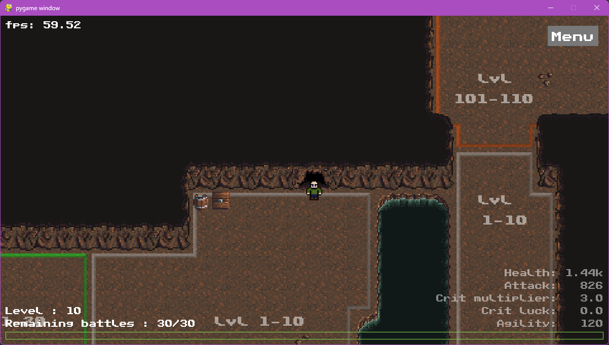
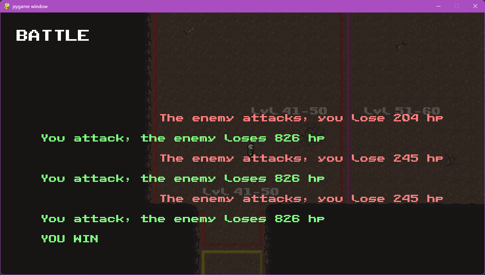

# RAPPORT PROJET POO "Inflation RPG Leremake"

***Thomas BIORET - Aurèle AUMONT--VESNIER***

## Avant propos
Ayant déjà de l'experience dans les jeux graphiques avec pygame,
nous avons décidé, bien que celà ne rentre que très peut dans la note,
de créer un jeu graphique. Nous avons bien sûr tout de même essayé de coller au mieux aux contraintes. Sachant que nous savons que vous connaissez déjà le vocabulaire, nous ne nous attarderons pas sur tout les mots lié au jeu vidéo, et nous autorisons les anglissismes connu. (equipement, stats, level-up...)

## Description du projet
Notre jeu s'inspire fortement du jeu [inflation RPG](https://play.google.com/store/apps/details?id=air.infurerpgkuesuto&hl=fr).

Le jeu s'articule autour d'un gameplay [roguelite](https://en.wiktionary.org/wiki/rogue-lite). Nous sommes laché à chaque partie dans une grotte, et le but est d'aller le plus loin possible et de level-up en un nombre donné de combat. A la fin de la partie, une récompense proportionnelle au niveau obtenu sera donné, permettant d'améliorer de l'equipement en vue d'une autre partie.

Le jeu contient donc une gestion de niveau et de stats remise à zéro à chaque partie, et d'une gestion de l'équipement, elle, sauvegardé entre les parties.

Les combats se lancent aléatoirement en fonction de la barre de combat (en bas de l'écran), et se font automatiquement suivant la zone de niveau dans laquelle le joueur se trouve au moment où le combat se lance. L'issue du combat est donc déterminé suivant la zone où le joueur se trouve et sa chance. Il est du devoir du joueur d'aller dans une zone assez haut level pour pouvoir monter rapidement en niveau, tout en faisant attention à ne pas voir trop grand.

pour plus d'informations, voir [première partie de jeu](#première-partie-de-jeu).

## dépendances

- python 3.6+
  - [pygame](https://github.com/pygame/pygame) 2.1+
  - [pytmx](https://github.com/bitcraft/pytmx) 3.31
  
### Python

**ATTENTION** : Nous utilisons des fonctionnalités récente de python, comme les [*type-hint*](https://realpython.com/lessons/type-hinting/). Ces fonctionnalités ne fonctionne que sur les versions de python ultérieurs à python 3.9+.
Une méthode très simple pour permettre d'utiliser ces annotations dans de plus anciennes version de python (comme celles du lycée) est d'ajouter cette ligne en haut de chaques fichiers
```py
from __future__ import annotations
```
Normalement nous avons fait attention à mettre celà partout, mais nous prévenons quand même, car nous ne savons pas si nous aurons le temps de tester le jeu sur les ordinateurs du lycée.

### Pygame
Ce module permet l'affichage graphique du jeu. Il est donc indispensable.

**ATTENTION** : pygame n'est pas à ce jour disponible pour python 3.11 (la dernière version de python). De ce fait, notre programme n'est pas non plus compatible avec cette dernière version.

### Pytmx
Ce module nous permet de charger des fichiers de map pour notre jeu. Sans ce module, nous ne pouvons pas charger de map, ou très difficilement. (convertissant à la main des fichiers de map en csv, puis en les lisant tel quel). Il permet concrêtement de [*parser*](https://www.lalanguefrancaise.com/dictionnaire/definition/parser) les fichiers **.tmx**, fichier de carte créé par l'éditeur de carte renommé [Tiled](https://www.mapeditor.org/). Celà permet ensuite à notre programme de jouer avec l'objet `TiledMap`, afin d'afficher la carte, connaitre l'emplacement des zones, des collisions...


## Installation

### dépendances
Nous partons du principe que votre environnement admet un python correctement installé, dans une des versions compatibles (3.6 à 3.10), et que les variables d'environnement sont correctement initialisé (c'est le cas au lycée).

Pour installer les dépendances il suffit d'effectuer les commandes suivantes.
```powershell
# installer pygame et/ou le mettre à jour
python -m pip install pygame --upgrade

# installer pytmx
python -m install pytmx
```

### lancement
Pour lancer le jeu depuis le terminal, il faut lancer le fichier `main.py`, situé dans le dossier `src/`. pour celà, effectuez les commandes suivantes :
```powershell
# se déplacer dans le dossier "src/" du projet
cd "[le/chemin/vers/le/dossier/du/projet]/src"

# lancer le jeu
python main.py
```

Si vous rencontrez des difficultés à installer les dépendances où lancer le projet, n'hésitez pas à nous contacter sur discord. (vous nous aviez par exemple expliqué que vous aviez des difficultés avec vos versions de python)

## Première partie de jeu

Une fois le jeu lancé pour la première fois et la partie lancé, vous atterissez dans une grotte. 
La première chose qui vous sera proposé est de définir vos stats de départ. En effet, pour ne pas mourir dans la première zone, vous commencez le jeu au niveau 10.


### explication des points de stats :
- Health : représente la vie du personnage. Est ensuite multiplié suivant le niveau d'armure.
- Attack : représente l'attaque du personnage. Est ensuite multiplié suivnt le niveau de l'épée.
- Crit luck : votre chance d'effectuer un coup critique est relative à cette valeur. ( $1 - \frac{1}{log_{10}(10 + points)}$ )
- Agility : représente votre vitesse. En combat, l'entité ayant le plus de vitesse attaquera en premier.


Une fois tout vos points réparti, vous pouvez cliquer sur "done". Vous pourrez ensuite commencer à vous déplacer.

A partir de ce moment, tout mouvement augmente la chance de lancer un combat. Cette chance est visible grâce à la barre de progression en bas de l'écran.
On peut également voir à gauche le niveau du joueur ainsi que le nombre de combats restant avant la fin de la partie, et à droite, on peut voir toutes les stats du joueur avec l'équipement d'appliqué (contrairement au menu des points de stats).



Attention à la zone dans laquelle vous vous trouvez, aller dans une zone de trop haut niveau peut vous coûter une defaite !

Au bout d'un moment, un combat vas se lancer.
Les combats se joue automatiquement, vous n'avez donc pas à vous en faire.



Une fois le combat terminé, proportionnellement à la différence de niveaux entre vous et l'ennemi, vous augmenterez de niveau, et gagnerez des points, que vous pourrez répartir à partir du menu des stats. Il se trouve en haut à droite (*Menu* -> *Stats*)


Vous pourrez grâce à vous stats nouvellement acquisent aller dans des zones de plus hant niveau afin d'avancer dans le jeu. Votre but est donc de monter le plus rapidement possible dans de hautes zones afin de pouvoir en fin de partie gagner plus d'argent, et acheter de meilleur equipement pour la prochaine partie. (l'equipement permettant de multiplier différentes stats, et donc de pouvoir monter dans de plus hautes zones à la partie suivante et gagner plus d'argent, ect...).

Une fois la partie terminé (les 30 combats écoulés), il y a donc cet ecran qui s'ouvre. Vous pouvez ici acheter de l'equipement qui servira au prochaines parties.


Attention, essayez d'acheter un maximum, car une fois cet ecran quitté, votre argent restant sera perdu !


### comment terminer le jeu :

Le jeu à été equilibré et testé de façon à ce que avec tout l'équipement au max, on puisse faire le tour des salles et aller dans la  dernière salle (niveau 200-210). Vous trouverez là-bas la sortie de la grotte (une porte avec de la lumière). en traversant cette porte, vous lancerez un combat contre le boss, et si vous le battez, vous pourrez voir les crédits.


## Structure du code

Afin de réaliser au mieux ce projet, et de vous permettre aussi de comprendre ce que l'on a fait, nous avons essayé de découper au mieux notre code.
Dans le dossier `src`, on le fichier `main.py` qui permet de lancer le jeu, ainsi que 3 dossiers : 
- `display` qui contient tout ce qui est en rapport avec l'affichage
- `engine` qui est en raport avec tout ce qui est moteur de jeu (chargement de la map en memoire, collisions, gestion de la boucle principale)
- `gameplay` qui s'occupe de tout ce qui est en rapport avec les mechaniques de jeu (stats, xp, equipement, sauvegarde de l'equipement, et combats)

Celà permet d'à peut près séparer ce qui est noté du reste (principalement `display`)

Nous avons essayé de commenter au mieux le code, en donnant la priorité au fichiers les plus importants.

## Fonctionnalités manquantes

Nous avons beaucoup travaillé pendant les vancances, donc nous avons à peut près fait tout ce que nous voulions pour ce projet.

En terme de combats, nous aurions peu faire de plus belles animations pour les ennemis, et rendre les combats plus vivants.

Nous aurions peu aussi augmenter la taille de la map et la détailler pour augmenter le temps de vie du jeu.

Enfin, le jeu ne contient pas de cheats-codes. nous aurions peu en ajouter. Nous en avons pas eu besoin pour le développement car nous avons délibérément choisis d'utiliser du json pour les saves, afin de pouvoir les modifier à la main.
## Répartition du travail

Nous avons essayé de nous répartir au mieux le travail, bien que travailler pendant les vacances de noël s'est révélé beaucoup plus dûr que prévu.

**Thomas**, qui est meilleur sur tout ce qui est graphique s'est occupé des menus et de la carte.

Moi (c'est **Aurèle** qui écrit), je me suis occupé de tout ce qui est moteur de jeu (système de combat, gestion interne de la map, système de sauvegarde...). Je fais aussi ce rapport.

Enfin **nous** avons travaillé ensemble sur le système d'équipement (car très lié à l'interface), ainsi que au système de stats en général. Afin d'équilibrer au mieux.

On peut regarder sur le github les participations de chacun pour plus de précision. (Si ce n'est pas public, je peut fournir les graphiques).

les fichiers `map_manager.py` et `camera_view.py` sont hérité de notre projet perso, mais très fortement modifiés. Tout les autres sont originaire directement du projet. (je ne sais en ce moment pas encore si nous utilisons votre fichier `filable.py`)